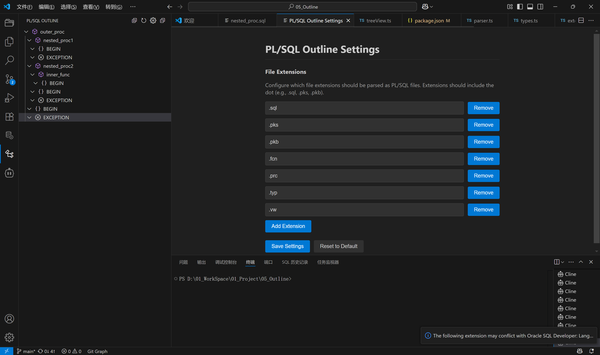
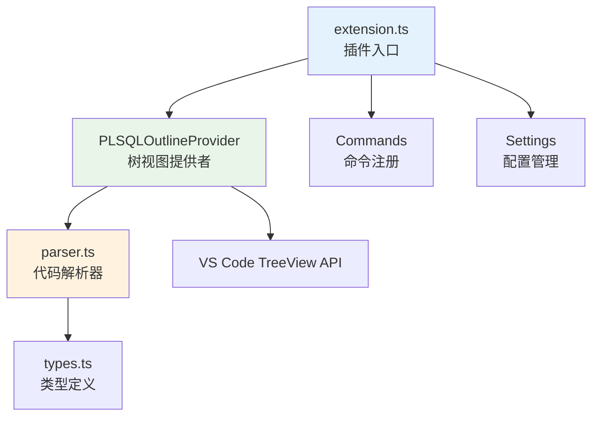
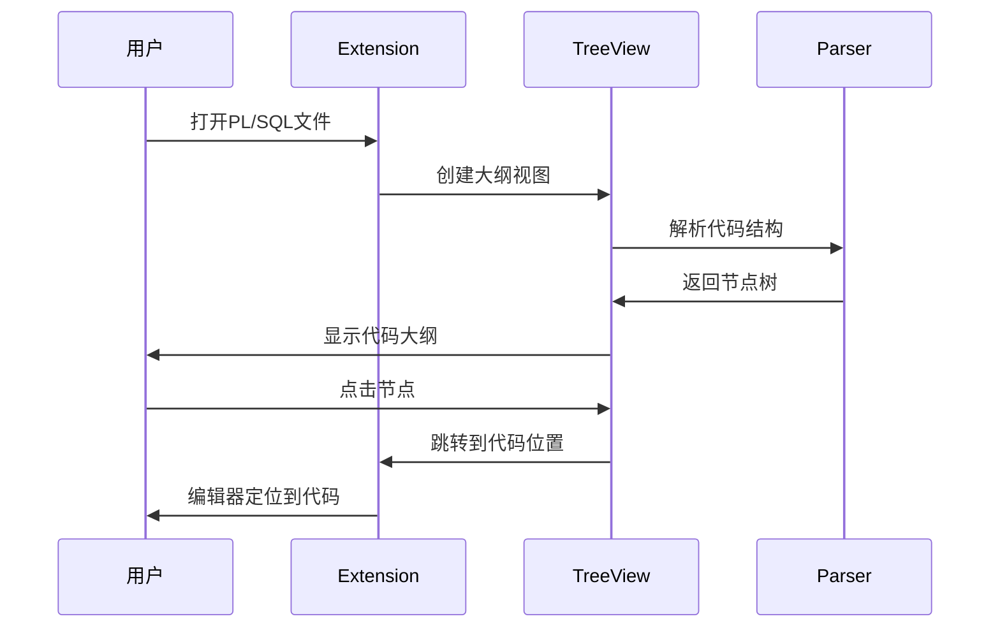

# PL/SQL Outline - VS Code 扩展

[](https://github.com/example/plsql-outline)
[](LICENSE)

专业的 PL/SQL 代码大纲视图扩展，为 VS Code 提供完整的 PL/SQL 代码结构分析和导航功能。



## ✨ 功能特性

### 核心功能
- 🔍 **智能代码解析** - 自动识别 PL/SQL 代码结构，支持嵌套函数和过程
- 🌳 **层次结构展示** - 清晰的树形视图显示代码组织结构
- 🎯 **精确代码导航** - 点击节点快速跳转到对应代码位置
- 🔄 **实时同步** - 光标位置与大纲视图自动同步
- ⚡ **实时更新** - 代码变更时自动刷新大纲结构

### 高级功能
- 📁 **全部展开/折叠** - 一键控制整个大纲树的展开状态
- ⚙️ **灵活配置** - 自定义支持的文件扩展名
- 🐛 **调试模式** - 详细的日志输出用于问题诊断
- 🔧 **设置面板** - 图形化配置界面

## 📦 安装方法

### 方式一：从 VSIX 安装包安装
1. 下载最新的 `.vsix` 安装包
2. 在 VS Code 中按 `Ctrl+Shift+P` 打开命令面板
3. 输入 `Extensions: Install from VSIX`
4. 选择下载的安装包文件

### 方式二：从源码构建
```bash
# 克隆仓库
git clone https://github.com/example/plsql-outline.git
cd plsql-outline

# 安装依赖
npm install

# 编译代码
npm run compile

# 打包插件
npm run package
```

## 🚀 使用说明

### 基本使用
1. **打开 PL/SQL 文件** - 支持多种文件格式（见下方支持格式表）
2. **激活大纲视图** - 在活动栏点击 PL/SQL Outline 图标
3. **浏览代码结构** - 在大纲树中查看代码组织
4. **快速导航** - 点击任意节点跳转到对应代码位置

### 工具栏功能
| 按钮 | 功能 | 说明 |
|------|------|------|
|  | 全部展开 | 展开大纲树中的所有节点 |
|  | 全部折叠 | 折叠大纲树中的所有节点 |
|  | 刷新 | 手动刷新大纲结构 |
|  | 设置 | 打开配置面板 |

## 📋 支持的文件格式

| 扩展名 | 描述 | 示例 |
|--------|------|------|
| `.sql` | 标准 SQL 文件 | `script.sql` |
| `.pks` | Package Specification | `my_package.pks` |
| `.pkb` | Package Body | `my_package.pkb` |
| `.fcn` | Function | `my_function.fcn` |
| `.prc` | Procedure | `my_procedure.prc` |
| `.typ` | Type Definition | `my_type.typ` |
| `.vw` | View Definition | `my_view.vw` |

### 支持的 PL/SQL 对象类型
- **PACKAGE** / **PACKAGE BODY** - 包规范和包体
- **PROCEDURE** - 存储过程（包括嵌套过程）
- **FUNCTION** - 函数（包括嵌套函数）
- **TRIGGER** - 触发器
- **DECLARE** - 声明块
- **BEGIN** - 执行块
- **EXCEPTION** - 异常处理块

## 🏗️ 项目架构

### 核心模块关系


### 用户交互流程


### 文件结构
```
plsql-outline/
├── src/
│   ├── extension.ts     # 插件入口，命令注册，事件监听
│   ├── treeView.ts      # TreeView 数据提供者，UI 交互
│   ├── parser.ts        # PL/SQL 代码解析器，语法分析
│   └── types.ts         # TypeScript 类型定义
├── package.json         # 插件配置，依赖管理
├── tsconfig.json        # TypeScript 编译配置
└── README.md           # 项目文档
```

## 🔧 配置选项

### 文件扩展名配置
在 VS Code 设置中搜索 `plsqlOutline.fileExtensions`，或直接编辑 `settings.json`：

```json
{
  "plsqlOutline.fileExtensions": [
    ".sql",
    ".pks", 
    ".pkb",
    ".fcn",
    ".prc",
    ".typ",
    ".vw"
  ]
}
```

### 调试模式
启用详细日志输出用于问题诊断：

```json
{
  "plsqlOutline.debugMode": true
}
```

启用后，可在 "输出" 面板的 "PL/SQL Outline Debug" 通道查看详细日志。

## 🛠️ 开发指南

### 环境要求
- Node.js 16+
- VS Code 1.101.0+
- TypeScript 5.0+

### 开发命令
```bash
# 安装依赖
npm install

# 编译 TypeScript
npm run compile

# 监听模式编译
npm run watch

# 打包插件
npm run package

# 发布新版本
npm run release
```

### 调试插件
1. 在 VS Code 中打开项目
2. 按 `F5` 启动调试会话
3. 在新窗口中测试插件功能

### 主要 API 接口

#### PLSQLNode 接口
```typescript
interface PLSQLNode {
    label: string;           // 节点显示名称
    type: string;            // 节点类型 (package, function, etc.)
    range?: vscode.Range;    // 代码位置范围
    children?: PLSQLNode[];  // 子节点数组
    parent?: PLSQLNode;      // 父节点引用
    icon?: string;           // 显示图标
    collapsed?: boolean;     // 折叠状态
}
```

#### 解析器函数
```typescript
function parsePLSQL(text: string): ParserResult {
    // 解析 PL/SQL 代码文本
    // 返回节点树和错误信息
}
```

## 🐛 故障排除

### 常见问题

**Q: 大纲视图不显示内容**
- 确认文件扩展名在支持列表中
- 检查文件是否包含有效的 PL/SQL 代码
- 尝试手动刷新大纲视图

**Q: 点击节点无法跳转**
- 确认文件已保存
- 检查代码是否有语法错误
- 重新加载 VS Code 窗口

**Q: 折叠/展开按钮无效**
- 更新到最新版本插件
- 启用调试模式查看日志
- 重新安装插件

### 调试步骤
1. 启用调试模式：`"plsqlOutline.debugMode": true`
2. 打开输出面板：`View > Output`
3. 选择 "PL/SQL Outline Debug" 通道
4. 重现问题并查看日志输出

## 🤝 贡献指南

欢迎提交 Issue 和 Pull Request！

### 提交 Issue
- 描述问题的详细步骤
- 提供示例代码文件
- 包含调试日志输出

### 提交 Pull Request
- Fork 项目仓库
- 创建功能分支
- 编写测试用例
- 提交 PR 并描述变更

## 📄 许可证

本项目采用 [MIT 许可证](LICENSE)。

## 🔗 相关链接

- [VS Code 扩展开发文档](https://code.visualstudio.com/api)
- [PL/SQL 语言参考](https://docs.oracle.com/en/database/oracle/oracle-database/21/lnpls/)
- [项目仓库](https://github.com/example/plsql-outline)

---

**享受更高效的 PL/SQL 开发体验！** 🚀
