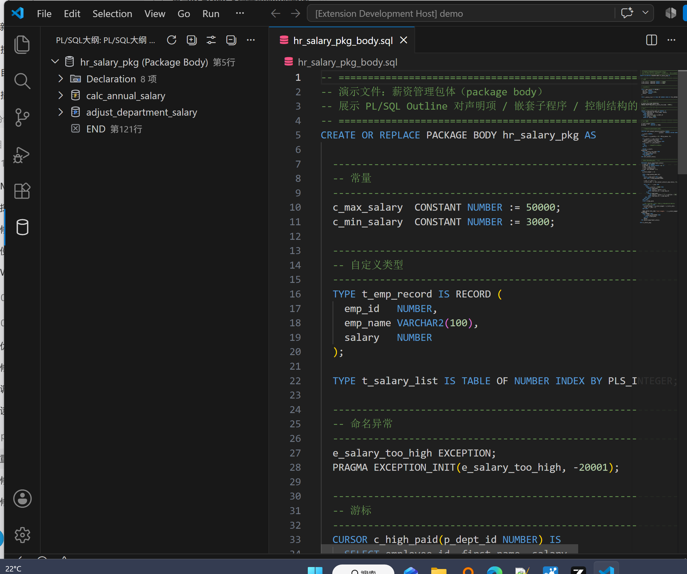
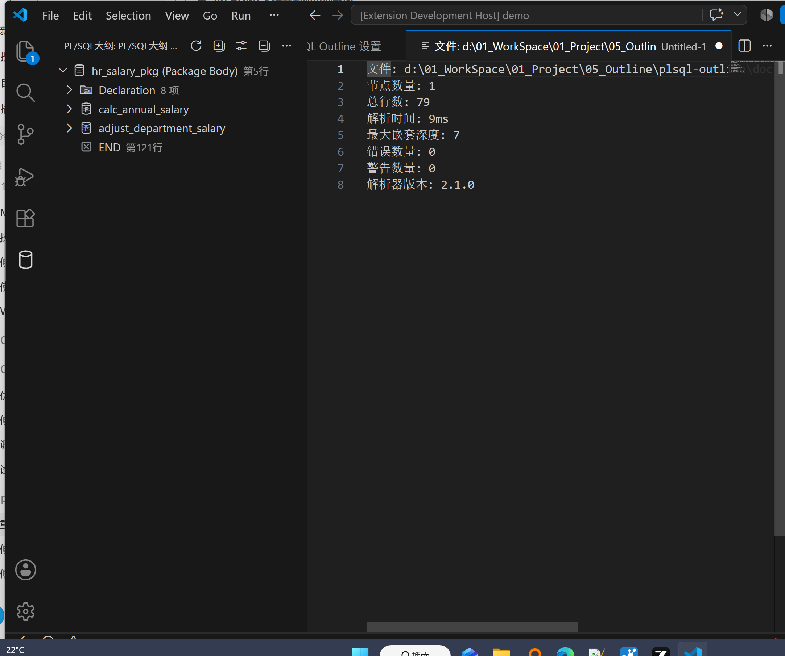
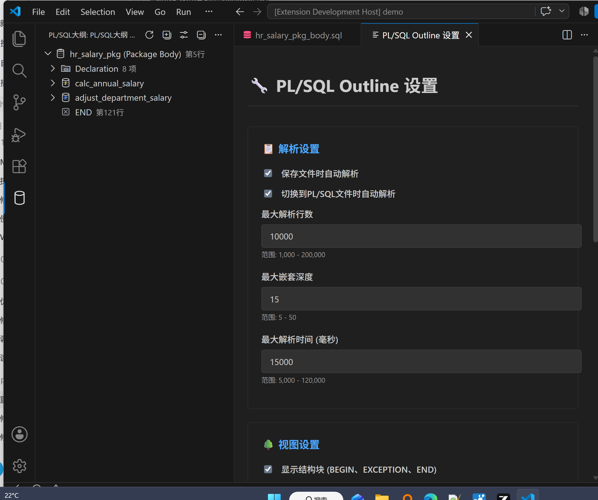

# PL/SQL Outline

<p>
  
</p>

[](https://marketplace.visualstudio.com/items?itemName=EmonZhang3438.plsql-outline)
[](https://marketplace.visualstudio.com/items?itemName=EmonZhang3438.plsql-outline)
[](https://marketplace.visualstudio.com/items?itemName=EmonZhang3438.plsql-outline)
[](LICENSE)

**让 VS Code 拥有像 PL/SQL Developer 一样专业的大纲视图。**

打开任意 PL/SQL 文件，扩展会把代码结构解析成一棵可点击的树：包、子程序、变量、游标、IF/LOOP/CASE 控制结构一目了然。点击节点跳转、Ctrl+点击跨文件跳转声明、万行大文件毫秒级解析。



> 上图：打开演示文件 `docs/demo/hr_salary_pkg_body.sql` 后，左侧自动出现大纲树——包体下挂着 Declaration（声明区）、两个子程序和 END，每个节点都可以点击跳转。

## 目录

- [功能特性](#-功能特性)
- [安装](#-安装)
- [快速上手（30 秒）](#-快速上手30-秒)
- [操作指南](#-操作指南)
- [配置项](#-配置项)
- [支持的文件类型](#-支持的文件类型)
- [常见问题](#-常见问题)
- [参与开发](#-参与开发)
- [反馈与联系](#-反馈与联系)
- [English](#english)

## ✨ 功能特性

### 🌳 结构化大纲视图

参照 PL/SQL Developer 的分区习惯，把代码组织成清晰的树：

```
hr_salary_pkg (Package Body)
├─ Declaration            声明区（按类别分组）
│  ├─ Variables           变量
│  ├─ Constants           常量
│  ├─ Cursors             游标
│  ├─ Types               自定义类型（RECORD / TABLE OF / VARRAY…）
│  └─ Exceptions          命名异常
├─ calc_annual_salary     包下子程序直接挂包名（函数 F / 过程 P 图标区分）
├─ adjust_department_salary
│  ├─ Declaration         子程序自己的声明区
│  ├─ Body                执行体（含 IF/ELSIF、LOOP、FOR、CASE、WHILE…）
│  ├─ EXCEPTION           异常处理区
│  └─ END
└─ END                    包体结束
```

- **声明项解析**：变量、游标、常量、自定义类型、命名异常，按类别分组显示，点击跳转到声明行
- **游标 SQL 悬浮**：鼠标悬浮大纲里的游标项（或编辑器内的游标名），直接显示该游标的完整 SQL 原文；悬浮过程/函数等单元节点（或编辑器内的单元名），聚合显示该单元内声明的全部游标 SQL，窗口高度随 SQL 数量自适应
- **控制结构分层**：IF/ELSIF/ELSE、LOOP/WHILE/FOR、CASE/WHEN 按代码层级缩进展示——原生树缩进每层 16px（默认 8px 的两倍）并带缩进参考线，图标与文字同层对齐；ELSIF/ELSE 分支内的控制结构同样可见；支持 3 级以上嵌套子程序
- **逐级展开**：控制结构与区域文件夹默认折叠，每次展开只露出一级，子层级按需逐级展开；工具栏「展开所有」仍可一键全展开
- **搜索过滤**：大纲顶部搜索框实时过滤方法/过程名——命中项及其父级保留、其余隐藏，过滤期间自动展开命中路径，回车跳转第一个命中，`Esc` / ✕ 清除并恢复原状
- **复制名称**：右键大纲项「复制名称」，把过程/函数/包/触发器等标识符复制到剪贴板
- **结构块显示**：BEGIN、EXCEPTION、END 等结构块可开关（`view.showStructureBlocks`）
- **光标联动**：在编辑器里移动光标，大纲自动跟随选中对应区域——声明区选 Declaration、执行体选 Body、异常区选 EXCEPTION，位于 LOOP/IF 内部时跟随到最内层控制结构（需要时自动展开宿主）；反之点击节点跳转代码

切换到包规范文件（`.pks` / spec）时，大纲同样清晰——常量、类型、子程序声明各就各位：


### 🔗 代码导航

| 操作 | 效果 |
|------|------|
| 点击大纲节点 | 跳转到该节点对应的代码行（展开/折叠只由左侧箭头控制） |
| `Ctrl+点击` 子程序名 | 跳转到该子程序的声明处（支持任意深度嵌套） |
| `Ctrl+点击` 游标 / 变量名 | 跳转到它的声明位置 |
| `Ctrl+点击` `pkg.proc` 形式 | 当前文件没有时，搜索配置的代码仓库路径，打开目标文件并跳转；多个结果时弹出选择列表 |

跨文件跳转依赖"代码仓库路径 + 符号索引"，在[配置项](#-配置项)的 `codeRepository` 部分设置。

### 🗂️ 代码折叠

编辑器内提供 PL/SQL 原生折叠箭头，折叠范围由解析器起止行号驱动（与大纲同源），折叠始终保留首行：

| 结构 | 折叠范围 |
|------|----------|
| Function / Procedure | 声明行 → END |
| DECLARE（匿名块） | DECLARE 行 → 块 END（整块） |
| BEGIN | BEGIN 行 → 该块 END |
| EXCEPTION | EXCEPTION 行 → 该块 END |
| IF / ELSIF / ELSE | IF 行 → END IF（整条分支链） |
| LOOP / WHILE / FOR | 起始行 → END LOOP |
| CASE | CASE 行 → END CASE |
| 匿名块 | DECLARE/BEGIN → END |
| Package Body | 包体起始行 → 结束 END |

ELSIF / ELSE / WHEN 分支不产生独立箭头（已包含在宿主块的折叠范围内）。

折叠、悬停与 Ctrl+Click 跳转按「语言 ID（SQL / PL/SQL）或 `plsql-outline.fileExtensions`
配置的扩展名」识别文件——文件即使未关联 PL/SQL 语言（如 `.fcn` / `.typ` 以纯文本打开），
只要扩展名在配置清单内同样生效。

### 🔗 结构关键字配对高亮

双击（或光标停留触发词高亮）结构关键字时，配对关键字一起高亮：

| 双击关键字 | 一起高亮 |
|------|----------|
| DECLARE / BEGIN / EXCEPTION / END | 该层级的 DECLARE、BEGIN、EXCEPTION、END（子程序无 DECLARE 则高亮其 BEGIN/EXCEPTION/END；按块层级隔离，不含嵌套块） |
| IF（含 END IF 中的 END / IF） | 该 IF 块的 IF、ELSIF、ELSE、END IF |
| FOR / WHILE / LOOP（含 END LOOP 中的关键字） | 该循环的 FOR/WHILE、LOOP、END LOOP |

非结构关键字（变量名等普通词）、字符串/注释内的关键字、END CASE 等暂未支持的结构，
保持 VS Code **原生相同词高亮**不受影响。关键字定位与解析器同口径跳过字符串
（含 Q-quote）与注释。

### 🎛️ 实用工具

- **解析统计**：一条命令查看节点数、总行数、解析耗时、嵌套深度、错误/警告数

  

- **可视化设置面板**：不用翻 settings.json，页面上直接改解析、视图、代码仓库选项，支持搜索、分组重置与配置导入/导出

  

- **结果导出**：把解析结果导出为 JSON（方便做二次处理或生成文档）
- **文件扩展名管理**：添加/删除/重置支持的文件类型（如 `.tbl`、`.vw`）
- **一键展开/折叠全部节点**、强制刷新重解析（解析进度显示在大纲视图内，完成后自动消失）、调试模式（输出详细解析日志到输出面板）

### ⚡ 性能

- 万行文件毫秒级解析（10,000 行约 20–65ms，13,000+ 行复杂嵌套 ~60ms）
- 字符级状态机剥离器，正确处理 `q'[...]'`（Q-quote）字符串、跨行字符串、字符串内的注释标记；支持带引号的标识符（`"SCHEMA"."PKG"`）、`.pck` 完整包文件，以及 **`dbms_metadata.get_ddl` 直接导出的源码**（`FORCE` / `EDITIONABLE` / `NONEDITIONABLE` 修饰词）
- 按需让出主线程 + 解析可取消：大文件解析期间界面保持响应，随时可以中断
- 33 文件 / 14 万行结构化测试语料保障解析正确性

## 📦 安装

**方式一：扩展市场（推荐）**

1. 打开 VS Code，按 `Ctrl+Shift+X` 打开扩展面板
2. 搜索 **PL/SQL Outline**（发布者 EmonZhang3438）
3. 点击"安装"

或直接访问 [VS Code Marketplace 页面](https://marketplace.visualstudio.com/items?itemName=EmonZhang3438.plsql-outline)。

**方式二：VSIX 文件**

```bash
code --install-extension plsql-outline-<版本>.vsix
```

或在 VS Code 里：命令面板（`Ctrl+Shift+P`）→ `Extensions: Install from VSIX...` → 选择 vsix 文件。

**方式三：从源码运行**（见[参与开发](#-参与开发)）

系统要求：VS Code ≥ 1.74，Windows / macOS / Linux 均可。

## 🚀 快速上手（30 秒）

1. 安装扩展后，打开任意 PL/SQL 文件（如 `.sql`、`.pkb`、`.pks`）
2. 点击左侧活动栏的数据库图标 🗄️（"PL/SQL 大纲"）
3. 大纲树自动生成——点节点跳转，`Ctrl+点击` 代码里的名字跨文件跳转

就是这么简单。示例代码在 [`docs/demo/`](docs/demo/) 目录，可以用它快速体验。

## 📖 操作指南

### 工具栏按钮

大纲视图顶部：

| 按钮 | 功能 |
|------|------|
| 🔄 刷新 | 强制重新解析当前文件并刷新大纲（解析进度显示在大纲视图内） |
| ⬇️ 展开所有 | 展开全部节点（折叠用节点左侧箭头） |
| ⚙️ 打开设置页面 | 打开可视化设置面板 |
| `...` 更多 | 切换结构块显示、调试模式、解析统计、导出结果 |

### 命令面板

`Ctrl+Shift+P` 输入 `PL/SQL Outline` 可看到全部命令：解析当前文件、刷新、展开所有、切换结构块显示、切换调试模式、显示解析统计、导出解析结果、管理文件扩展名、重建符号索引。

### 节点图标速查

所有图标为统一的"数据库圆筒"主题，提供明/暗两套变体，自动适配当前主题：

| 节点 | 图标 | 节点 | 图标 |
|------|------|------|------|
| 包（规范/体） | 数据库圆筒 | 变量 | 圆筒+变量标记 |
| 过程 | 圆筒+蓝色 **P** | 游标 | 圆筒+箭标 |
| 函数 | 圆筒+琥珀 **F** | 常量 | 圆筒+锁标 |
| 触发器 | 圆筒+闪电 | 自定义类型 | 圆筒+类型标 |
| 匿名块 | 圆筒+`</>` | 命名异常 | 圆筒+叹号 |
| Declaration 文件夹 | 圆筒文件夹 | Sub Program 文件夹 | 圆筒文件夹+P/F |
| BEGIN / EXCEPTION / END | 结构块圆筒 | Body 文件夹 | 圆筒文件夹+播放标 |

## ⚙️ 配置项

在 VS Code 设置中搜索 `plsql-outline` 即可修改，推荐用扩展自带的可视化[设置面板](res/screenshots/settings-panel.png)（大纲工具栏 ⚙️ 按钮）。

**解析**

| 配置项 | 默认值 | 说明 |
|--------|--------|------|
| `parsing.autoParseOnSave` | `true` | 保存文件时自动重新解析 |
| `parsing.autoParseOnSwitch` | `true` | 切换到 PL/SQL 文件时自动解析 |
| `parsing.maxNestingDepth` | `15` | 最大嵌套深度（5–30），深度保护防止异常嵌套 |

**视图**

| 配置项 | 默认值 | 说明 |
|--------|--------|------|
| `view.showStructureBlocks` | `true` | 显示 BEGIN / EXCEPTION / END 结构块 |
| `view.expandByDefault` | `true` | 默认展开树节点 |
| `view.autoSelectOnCursor` | `true` | 光标移动时自动选中对应大纲节点 |
| `view.showDeclarations` | `true` | DECLARE 区显示声明项 |
| `view.groupDeclarations` | `true` | 声明项按类别分组（关闭则平铺） |

**文件类型**

| 配置项 | 默认值 | 说明 |
|--------|--------|------|
| `fileExtensions` | `.sql .fnc .fcn .prc .pks .pkb .pck .typ` | 参与解析的文件扩展名（用户级，跨工作区生效） |

**代码仓库（跨文件跳转）**

| 配置项 | 默认值 | 说明 |
|--------|--------|------|
| `codeRepository.paths` | `[]` | 代码仓库路径，最多 2 个；数字越小优先级越高，高优先级找到后不再搜索低优先级 |
| `codeRepository.fileExtensions` | `.sql .fnc .fcn .prc .pks .pkb .pck .typ` | 符号索引扫描的扩展名 |
| `codeRepository.autoIndex` | `true` | 启动时自动构建符号索引 |
| `codeRepository.maxFiles` | `5000` | 索引最大扫描文件数（100–20000） |

**调试**

| 配置项 | 默认值 | 说明 |
|--------|--------|------|
| `debug.enabled` | `false` | 启用调试日志（输出面板 `PL/SQL Outline` 通道） |
| `debug.logLevel` | `INFO` | 日志级别：ERROR / WARN / INFO / DEBUG |

## 📁 支持的文件类型

默认支持：`.sql`、`.fnc`、`.fcn`、`.prc`、`.pks`、`.pkb`、`.pck`（spec+body 二合一的完整包文件）、`.typ`。

扩展同时注册了 `plsql` 语言（`.pks` / `.pkb` / `.pck` / `.prc` / `.fnc` / `.trg`），提供 PL/SQL 的括号匹配、注释等基础语言支持。

其他类型（如 `.tbl`、`.vw`、`.trg`）用 **PL/SQL Outline: 管理文件扩展名** 命令随时添加。

## ❓ 常见问题

**Q：打开文件后大纲是空的？**
检查文件扩展名是否在支持列表中（用"管理文件扩展名"命令查看/添加）；确认内容是有效的 PL/SQL；点击大纲工具栏的 🔄 刷新按钮。

**Q：点击节点没反应？**
点击节点名称是"跳转"而不是"展开"——展开/折叠请用节点左侧的箭头。

**Q：Ctrl+点击不能跨文件跳转？**
跨文件跳转需要在设置中配置 `codeRepository.paths`（指向你的代码仓库根目录），扩展会自动建立符号索引。

**Q：超大文件解析慢？**
解析过程可随时取消（进度通知上的"取消"按钮）；也可以调小 `parsing.maxNestingDepth` 减少深层解析。扩展对超过 10MB / 5 万行的文件有内置保护。

**Q：怎么报告解析错误？**
开启调试日志（`debug.enabled`），在输出面板选择 `PL/SQL Outline` 通道查看详细日志，然后到 [GitHub Issues](https://github.com/Emon9426/plsql-outline/issues) 提交（见[反馈与联系](#-反馈与联系)）。

## 🛠️ 参与开发

```bash
git clone https://github.com/Emon9426/plsql-outline.git
cd plsql-outline
npm install
npm run compile         # 编译 TypeScript（所有测试依赖 out/ 产物）
npm test                # 单元套件（tests/unit，333+ 断言）
npm run test:corpus     # 33 文件 / 14 万行语料回归（解析层 + 显示层）
npm run test:regression # 回归套件（tests/regression，11 个）
npm run test:e2e        # 真实 VS Code 端到端测试
npm run bench           # 解析性能基准
# 在 VS Code 中按 F5 启动 Extension Development Host 调试
npm run package         # 打包 vsix 到 release/ 目录
```

测试体系与基线说明见 [`tests/`](tests/) 各子目录与 [`.ai/testing.md`](.ai/testing.md)。

## 💬 反馈与联系

欢迎提交问题与建议，两种方式任选：

**1. GitHub Issues（推荐）**

→ [github.com/Emon9426/plsql-outline/issues](https://github.com/Emon9426/plsql-outline/issues)

解析错误、功能建议、文档问题都可以提。为保证快速定位，建议附上：

- VS Code 版本与扩展版本
- 能触发问题的**最小代码片段**（请去除业务敏感信息）
- 期望的大纲结构 vs 实际显示

**2. 邮件联系开发者**

→ [emonzhang3438@outlook.com](mailto:emonzhang3438@outlook.com)

适合：不方便公开的代码片段、使用咨询、合作交流。一般在 1–3 个工作日内回复。

## 🙏 致谢

- [@fddc](https://github.com/fddc) —— 通过 [Issue #1](https://github.com/Emon9426/plsql-outline/issues/1) 报告了 `dbms_metadata.get_ddl` 导出源码的支持需求，并提供了真实环境的 `.pck` 样本文件。该样本已成为项目测试语料库的一部分，持续保障 `.pck` / 带引号标识符 / get_ddl 输出形态的解析质量。

## 📜 更新日志

完整的版本历史见 [CHANGELOG.md](CHANGELOG.md)。

## 📄 许可证

[MIT](LICENSE)

## English

**PL/SQL Outline** is a Visual Studio Code extension that parses PL/SQL code into a clickable, PL/SQL Developer-style outline tree.

**Features**

- Structure tree for packages (spec/body), procedures, functions, triggers and anonymous blocks, with nested sub-programs and control structures (IF/LOOP/CASE) indented by nesting level
- Declaration items (variables, cursors, constants, types, named exceptions) grouped by category under `Declaration`
- Click a node to jump to its line; `Ctrl+Click` an identifier in code to jump to its declaration — across files via configurable repository paths and a symbol index
- Cursor ↔ outline two-way sync, expand-all, parse statistics, JSON export, a visual settings panel, and a manageable file-extension list
- Fast: 10,000-line files parse in ~20–65 ms; Q-quote strings handled by a character-level state machine; parsing is cancellable
- Works with raw `dbms_metadata.get_ddl` output (`FORCE` / `EDITIONABLE` / `NONEDITIONABLE`), quoted identifiers and `.pck` files

**Install**: search "PL/SQL Outline" in the VS Code marketplace, or from the [marketplace page](https://marketplace.visualstudio.com/items?itemName=EmonZhang3438.plsql-outline).

**Quick start**: open a PL/SQL file, click the database icon in the activity bar, and the outline appears. See `docs/demo/` for sample code and [CHANGELOG.md](CHANGELOG.md) for release history.

**Feedback & Contact**

- GitHub Issues: [github.com/Emon9426/plsql-outline/issues](https://github.com/Emon9426/plsql-outline/issues) — please include your VS Code / extension versions, a minimal code snippet, and the expected vs. actual outline
- Email the developer: [emonzhang3438@outlook.com](mailto:emonzhang3438@outlook.com)

License: [MIT](LICENSE).
